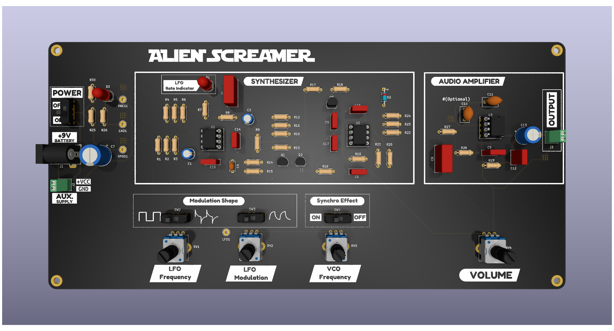

# Alien_Screamer_Synth
PCB design for "Alien Screamer" (modified) synthesizer (original design by Ray Wilson) in 4-layer stackup using THT components.

## 👽👾 Project Description
The **Alien Screamer** Analog Noise Box is a classic Lo-Fi analog synthesizer designed by Ray Wilson of *Music From Outer Space* capable to creating Sci-Fi sound effects. It serves as an excellent introductory project for synth-DIY enthusiasts, providing a hands-on way to learn about oscillators, modulation, and integrated circuit amplification.

For more detailed technical information and the original schematics, visit the [MFOS Alien Screamer Noise Box](https://musicfromouterspace.com/analogsynth_new/ALIENSCREAMER/ALIENSCREAMER.php)

## 🚀 Main Features
* **Wide-Range VCO:** A ramp-core oscillator driven by an exponential V-to-I converter, capable of frequencies from sub-audio clicks to 10kHz.
* **Integrated LFO:** A square-wave oscillator with adjustable rate and depth.
* **Waveform Shaping:** Toggle between square, low-pass filtered, and differentiated "tweet" waveforms for diverse modulation.
* **Sync Effects:** Hard-sync capability where the LFO resets the VCO for aggressive, complex timbres.
* **Built-in Audio:** Includes an LM386-based 1W amplifier and 8-Ohm speaker for portability.
* **9V-Battery Powered:** Optimized for low current draw (~10mA) on a single 9V battery.

## 🛠 Technical Overview
The circuit is built around 2x primary ICs:
- LM324 (Quad Op-Amp): Handles the VCO exponential converter, the ramp generator/comparator, and the LFO
- LM386 (Power Amp): Drives the internal speaker
- 4x Control Potentiometers: LFO Frequency + LFO Modulation Depth + VCO Frecuency + Volume 
- 2x Control Switches: LFO Modulation Waveform Selector + Synchro Effect

## 📂 Project Structure
* `doc/` - KiCad schematic and Datasheets.
* `bom/` - Bill of Materials (BOM) for component sourcing.
* `hardware/` - KiCad Design files (schematic and PCB layout routing).
* `gerbers/` - PCB gerber and drill files for production.
* `renders/` - High quality PCB images.

### PCB Features
- Layers: 4
- Thickness: 1.6mm
- Width: 250mm
- Heigth: 119.5mm

### 3D Render

## Tools Used
KiCad: 9.0.4

> **Note:** This project is designed for educational and DIY purposes. Original design by Ray Wilson (Music From Outer Space).

## Disclaimer
\*\*This design is provided "AS-IS" without any express or implied warranties.\*\* The author is not responsible for any damage to equipment, fire, or personal injury resulting from the assembly or use of this PCB.
